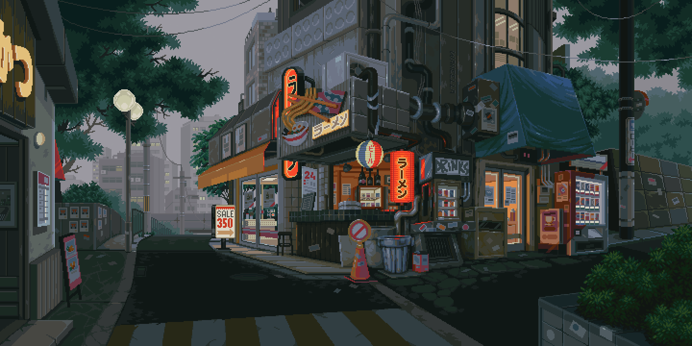
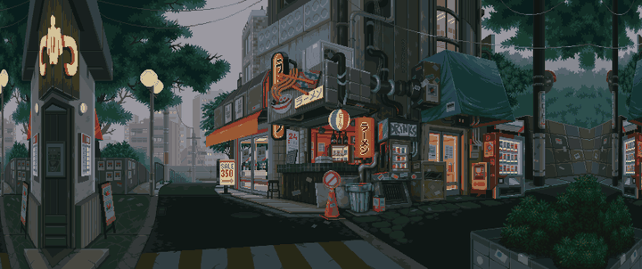

# Mac-Dynamic-Wallpapers

Dynamic wallpaper script for MacOS that turns any GIF into a useable wallpaper

## Project structure

 * `scripts/extract_frames.py` - Extract GIF frames as lossless PNG files.
 * `scripts/play_wallpaper.py` - Play extracted frames using `appscript` (default).
 * `scripts/play_wallpaper_osascript.py` - Alternative playback using `osascript`.
 * `video/` - Generated frames (created automatically).

## Setup

 * Clone the repository and `cd` into it.
 * Run `pip3 install -r requirements.txt`.

## Usage

 * Extract frames:
   `python3 scripts/extract_frames.py /path/to/your.gif`
 * Start wallpaper playback:
   `python3 scripts/play_wallpaper.py --fps 2`
 * Alternative playback backend:
   `python3 scripts/play_wallpaper_osascript.py --fps 2`
 * Enable auto-start at login:
   `./scripts/install_autostart.sh`
 * Check auto-start status:
   `launchctl print gui/$(id -u)/com.moritzvonburen.dynamicwallpaper`
 * Disable auto-start:
   `./scripts/uninstall_autostart.sh`

## Desktop Preview

<table>
  <tr>
    <th>Before (zoom/crop)</th>
    <th>After (mirror-fill)</th>
  </tr>
  <tr>
    <td></td>
    <td></td>
  </tr>
</table>

## Notes

 * Frames are exported as lossless PNG files (`video/frame_00000.png`, etc.) to keep original quality.
 * Use `--output` on extraction and `--folder` on playback to customize directories.
 * For ultrawide/widescreen monitors, extraction uses `--size auto` by default and applies mirrored borders to avoid aggressive zoom (`--placement mirror-fill`).
 * You can set size manually, e.g. `python3 scripts/extract_frames.py /path/to/your.gif --size 5120x1440`.
 * Auto-start uses macOS `launchd` (`RunAtLoad` + `KeepAlive`) and starts playback automatically when you log in.
 * Stop playback with `Ctrl+C`.
